# ThumbyCue

**Accurate 3D snooker & pool for the [Thumby Color](https://thumby.us/).**

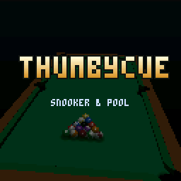

ThumbyCue is a full cue-sports game running on the Thumby Color's RP2350
(dual Cortex-M33 @ 280 MHz, 520 KB SRAM, 128×128 RGB565 screen). It packs a
real impulse-based ball physics engine, a 3-D flat-shaded table with round,
smoothly-lit balls (see [Rendering](#rendering)), a simulation-driven computer
opponent with eight distinct personas, best-of match play, and a broadcast-style
scoreboard — all in a ~130 KB image.

The renderer and dual-core rasteriser are vendored from
[ThumbyElite](https://github.com/austinio7116/ThumbyElite); the physics, rules,
AI, and UI are ThumbyCue's own.

---

## Tables & games

| Mode | Table | Notes |
|------|-------|-------|
| **UK 8-Ball** | 7 ft, rounded pockets | Yellow/red or yellow/blue sets, two-shot carry |
| **US 8-Ball** | 9 ft, mitred pockets | PRO numbered solids & stripes |
| **Chinese 8-Ball** | 10 ft, tight rounded pockets | Solids & stripes, WPA rules |
| **US 9-Ball** | 9 ft | Lowest-ball-first, the run shown on the side |
| **Snooker 15** | 12 ft | Full snooker — 15 reds + 6 colours |
| **Snooker 10** | 10 ft | Ten-red snooker |
| **Snooker 6** | 7 ft UK table | Fast 6-red snooker on the small bed |

One physics/render model feeds every table, so the felt you see and the felt
the balls bounce off are guaranteed identical.

<p>
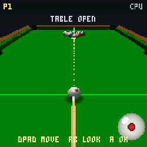
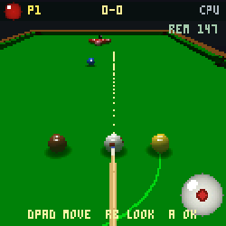
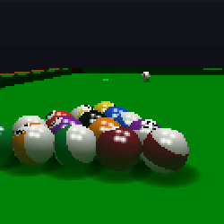
</p>

### Ball sets

Every game racks with its own balls — the pool sets (PRO numbered, UK yellow/blue
and yellow/red, Dynasphere, Pro-Tour) are picked in the PLAY menu:

<p align="center">
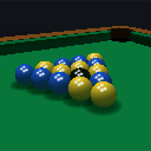
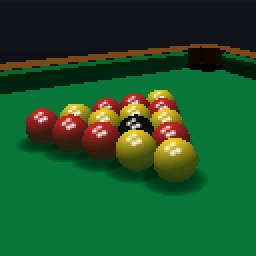
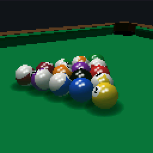
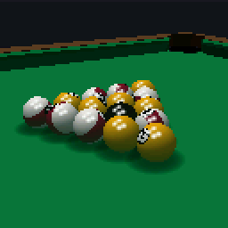
</p>
<p align="center">
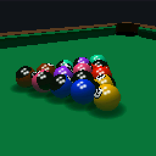
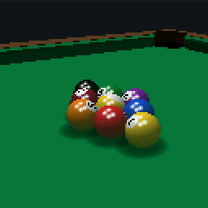
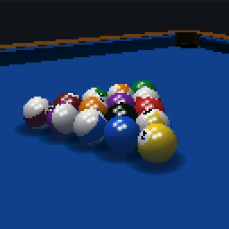
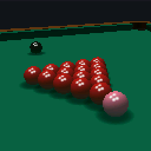
</p>

### Felt colours

Pool tables can be played on any of five cloths (snooker is always tournament green):

<p align="center">

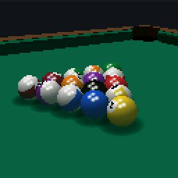
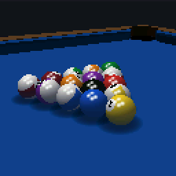
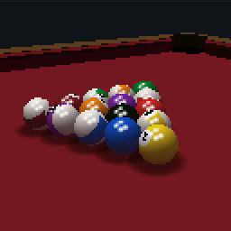
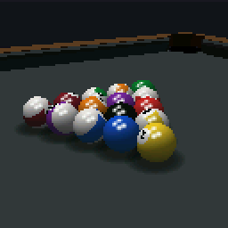
</p>

---

## Physics

A fixed-substep (~2 kHz) integrator drives ball motion from the frame time, so
behaviour is frame-rate independent. Every ball carries full 3-D angular
velocity, so spin physics is real rather than faked:

- **Cloth friction phases** — sliding (kinetic friction develops the correct
  roll for draw/follow/stun), rolling (light resistance), and spinning (side
  "english" decays on its own).
- **Impulse collisions** with Coulomb friction — ball–ball throw and
  english-off-the-cushion fall out of the same framework.
- **Cushion model** — a tilted contact normal couples top/back spin into the
  rebound; restitution and rail friction are tuned per the real game.
- **Pockets** — drop capture matched to the visible cloth/lip cutaway; balls
  rattle the jaws and sink with a settle animation.

All in SI units (metres, kilograms, seconds): cloth at y = 0, ball centre at
y = R.

### Spin, swerve & masse

Hold **B** and use the d-pad to move the cue tip on the ball: left/right for
side **english**, up/down for **follow/draw**. The spin dial (bottom-right)
shows the exact contact point.

Hold **B + RB** and tilt up/down to **raise the cue butt** — side spin plus
elevation curves the ball's path (swerve), and steep elevation produces a
masse. The cue is also forced up automatically when the shaft would otherwise
pass through a cushion or another ball behind the cue ball, so you can never
strike an impossible shot.

The cue itself is drawn as a tapered, shaded stick with an ivory ferrule and a
blue tip; it rests at the chosen contact point and angles along the elevated
cue so the visual matches the shot you're about to play.

---

## Rendering

The table is a flat-shaded triangle mesh drawn by a depth-tested, dual-core
rasteriser (both cores draw their half of the screen). The balls, though, are
**sphere impostors** rather than 3-D meshes — a real sphere mesh is hundreds of
triangles, and 22 of them at once would never fit the RP2350's frame budget.

Instead each ball is drawn as a single screen-space **disc** and lit *per pixel*.
For every pixel inside the disc the shader works out which point on the sphere's
surface it maps to (the surface normal, from the pixel's offset within the disc),
and from that:

- shades it from the table light plus a white **specular** highlight, so it reads
  as a rounded, glossy ball;
- samples the ball's texture using its current 3-D **orientation**, so numbers,
  stripes and the cue ball's spots rotate correctly as the ball rolls and spins;
- writes a per-pixel **depth** so balls correctly occlude one another, the
  cushions and the cue.

The result looks like a fully-lit 3-D sphere with live english, for roughly the
cost of filling a flat circle — which is what lets a full snooker rack render at
frame rate on a 280 MHz core. (The technique is vendored, with the rasteriser,
from [ThumbyElite](https://github.com/austinio7116/ThumbyElite), where it draws
planets.)

---

## The computer opponent

ThumbyCue's AI is a port of a simulation-driven pool AI: for every legal
target × pocket it builds ghost-ball geometry, sweeps power and spin variants,
scores each by potting difficulty **and the quality of the resulting leave**,
then runs the **real physics engine headless** on the best few candidates to
pick the shot with the best position. It plays safeties (and in snooker, lays
snookers and reads when it needs them), escapes snookers off a cushion, and
breaks properly.

Eight personas span a wide skill range — each with its own aim accuracy, power
control, spin ability, positional awareness, safety bias and shot selection:

| Persona | ELO | Style |
|---------|-----|-------|
| Rookie Rick | 1278 | Wild, random shot choice |
| Steady Sue | 1382 | Cautious, plays position |
| Hustler Hank | 1447 | Aggressive potter |
| Professor Pete | 1428 | Methodical, strong safety |
| Clara "Cue Queen" | 1501 | All-round |
| Deadshot Dave | 1633 | Fearless long potter |
| Iron Nina | 1715 | Near-flawless |
| The Machine | — | Perfect aim & position |

Pick your opponent (or **Player 2**) and the match length on the Play screen.

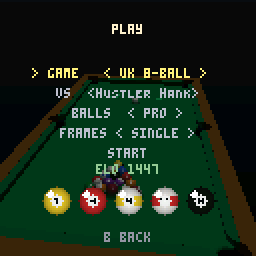

---

## Match play & the scoreboard

Choose **Single** frame or **best-of 3 / 5 / 7**. The breaker is coin-flipped
for the first frame and alternates thereafter; the match runs to the majority
of frames.

The HUD is modelled on broadcast snooker boards — frame score and match frames
on one line, the current **break** just below, **points remaining** bottom-left,
and the player whose turn it is highlighted. Each game shows the relevant
on-ball: group balls for 8-ball, a red / colour / multicolour ball for snooker,
and the numbered ball for 9-ball.

<p>
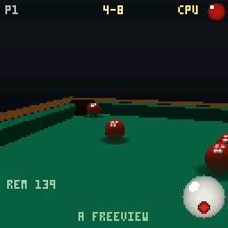
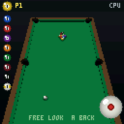
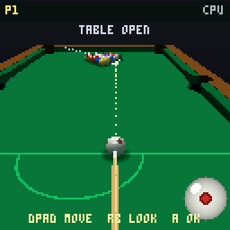
</p>

In **9-ball**, free-look shows the whole run still to pot as a column of small
balls down the side — there when you need it, out of the way when you don't.

---

## Controls

| Action | Buttons |
|--------|---------|
| Aim | **◀ ▶** (hold to accelerate) · **RB + ◀▶** = ultra-fine |
| Camera | **▲ ▼** pitch · **RB + ▲▼** zoom |
| Spin (english / follow / draw) | hold **B** + d-pad |
| Swerve / masse (raise butt) | hold **B + RB** + **▲ ▼** |
| Power & strike | press & hold **A**, **▼** to draw back, release **A** to fire |
| Free-look (roam the table) | **LB** · hold **B** to pan · **A**/**LB** to exit |
| Ball-in-hand | d-pad to move · **RB** to orbit · **A** to place |
| Pause / menu | **MENU** |
| Freeview during a shot | **A** |

On the SDL host: `W A S D` = d-pad, `.` = A, `,` = B, `Left-Shift` = LB,
`Space` = RB, `Enter` = Menu.

---

## Building

Development happens on the SDL2 host first; the device is built and flashed
afterwards.

```bash
# Host (PC) — the game in a window, plus headless screenshot / self-tests
cmake -B build_host -S host && cmake --build build_host -j8
./build_host/thumbycue_host                       # play (pool)
./build_host/thumbycue_host snooker
CUE_SHOT=/tmp/s.ppm ./build_host/thumbycue_host   # headless 128×128 screenshot
CUE_PHYSTEST=1 ./build_host/thumbycue_host        # physics self-tests

# Device (RP2350 / Thumby Color)
cmake -S device -B build_device -DPICO_SDK_PATH=$HOME/mp-thumby/lib/pico-sdk
cmake --build build_device -j8
cp build_device/thumbycue.uf2 ../firmware_thumbycue.uf2
```

To flash: power off, hold **DOWN** on the d-pad, power on → the device mounts as
`RPI-RP2350`; copy the `.uf2` onto it.

---

## ThumbyOne slot

ThumbyCue also builds as a slot inside the
[ThumbyOne](https://github.com/austinio7116) multi-boot firmware (the **POOL /
SNOOKER** slot). In slot mode it honours the lobby's brightness/volume, mounts
the shared FAT, and the pause menu's **LOBBY** item returns you to the
selector. The standalone build is unchanged.

---

## Repository layout

```
game/     platform-independent core (physics, rules, AI, render, UI)
host/     SDL2 host shell (PC build + screenshot/test harness)
device/   RP2350 platform layer (LCD, buttons, PWM audio, rumble)
docs/     screenshots
tools/    AI self-play harness
```

See [`CLAUDE.md`](CLAUDE.md) for engine conventions and the module map.
</content>
